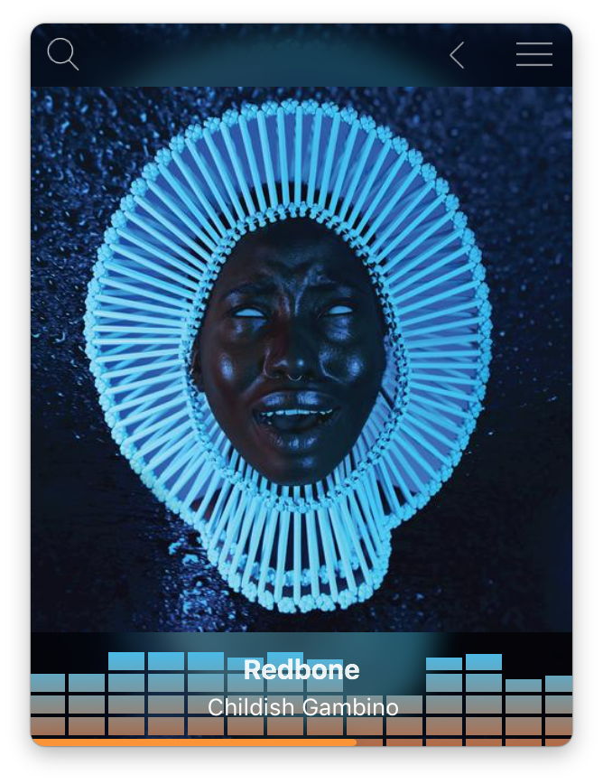
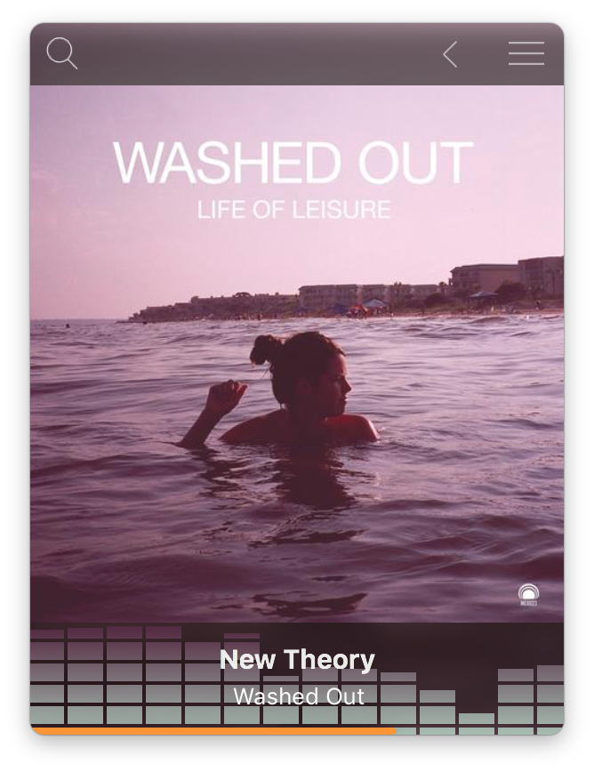

# Milkshake Pandora Music Client 

Milkshake is a Mac OS X Pandora client.

If you don't have a Pandora account, you can [sign up here](https://www.pandora.com/account/register)

# Important note
This client isn't a full Pandora replacement and hasn't been fully tested on the free version.  This client doesn't support creating playlists yet, you'll still need to create them on pandora.com.

# Features
  - Minimalist UI that focuses on album art
  - Shortcuts
  - Cross fading
  - Keep player as front window
  - Easy navigation

# Shortcuts
Keys | Action 
--- | --- | 
^⌘]  | next song 
^⌘[  | previous song
^⌘P | pause song
^⌘R | repeat song
^⌘+| thumb up
^⌘-| thumb down 

Icons made by [Smashicons](https://www.flaticon.com/authors/smashicons) from [flaticon.com](https://www.flaticon.com/) is licensed by [CC 3.0 BY](http://creativecommons.org/licenses/by/3.0/)

